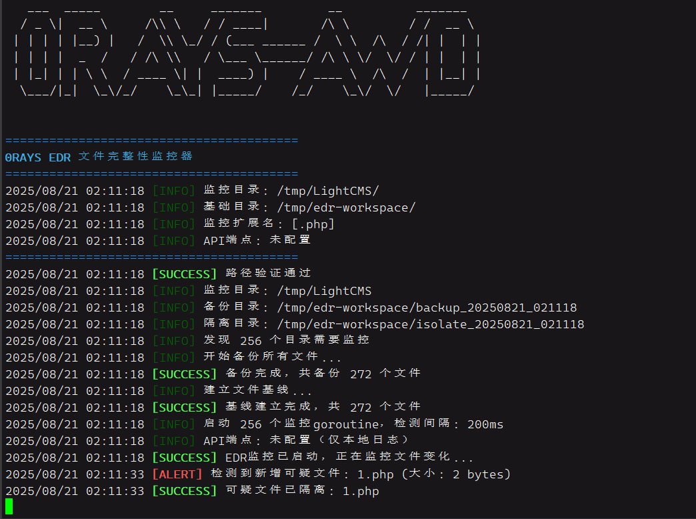

# 0RAYS-AWD-Filechecker

一个用Golang编写的, 轻量级的文件监控器, 会监控指定文件夹内文件删除, 修改, 新增操作, 然后立刻告警并复原.

一开始是为AWD比赛写的, 主要是为了防止靶机的web目录被上马. 但也可以用到蓝队等场景上.

由于使用的Linux的系统调用, 仅支持Linux环境使用.



### 工作流程

1. 程序启动后会首先扫描指定目录下的文件和子目录, 然后备份指定的workspace文件夹中
2. 递归找出所有子目录, 然后为每一个子目录分配一个goroutine
3. 每个goroutine每200ms列目录, 然后对文件lstat, 检查时间和字节数是否有变化
4. 观察是否有删除, 新增, 修改等. 如果有立刻恢复备份文件夹中的文件
5. 如果设置有API, 会上报告警可疑的变化, 没有则会在终端中打印
6. 新增的可疑文件会被隔离, 供观察

```plaintext
┌─────────────────┐    HTTP API   ┌──────────────────┐
│    文件监控器     │ ────────────► │  notifier.py     │
│  (awd-checker)  │               │  (桌面弹窗告警)    │
└─────────────────┘               └──────────────────┘
         │
         ▼
┌─────────────────┐
│  靶机文件系统     │
│  ┌─── 监控 ─┐    │
│  ├─── 备份 ──┤   │  
│  └── 隔离 ──┘    │
└─────────────────┘
```

### 功能特性

- 支持指定拓展名, 例如指定php文件, 这样避免监控一些静态的html,css文件, 减少占用
- 递归搜索子目录的内容
- 高频检测, 期望响应时间100ms, 基本上php马刚传上来就立刻被删除
- notifier.py支持跨平台, 有python环境即可, 会通过弹窗告警, 告知选手或队员立即处理问题

### 使用

release里面直接下载对应的平台的版本即可

或者go build awd-filechecker.go即可

#### Filechecker参数

```
-m 监控目录路径(必须)             -m /var/www/html
-b workspace目录路径(必须)       用于存放backup_和isolate_子目录-b /home/ctf/edr_workspace
-e 监控的文件扩展名,逗号分隔       -e .php,.jsp,.html
-a API端点地址，用于发送告警       -a 172.16.66.66:8080
-h 显示帮助信息
```

#### notifier.py参数

```
-p, --port    HTTP服务监听端口8080
-H, --host    监听地址0.0.0.0
--no-sound    禁用告警音效
--test        发送测试通知
```

#### 典型场景

监控php webshell:

```bash
./awd-filechecker -m /var/www/html -b /home/ctf/edr_workspace -e .php -a [选手靶机]:8080
```

监控jsp, 不使用notifier

```bash
./awd-filechecker -m /var/www/html -b /home/ctf/edr_workspace -e .jsp,.asp
```

### notifier api接口

```plaintext
GET /api/agent/edr-alert?type=warning&message=检测到可疑文件shell.php
```

